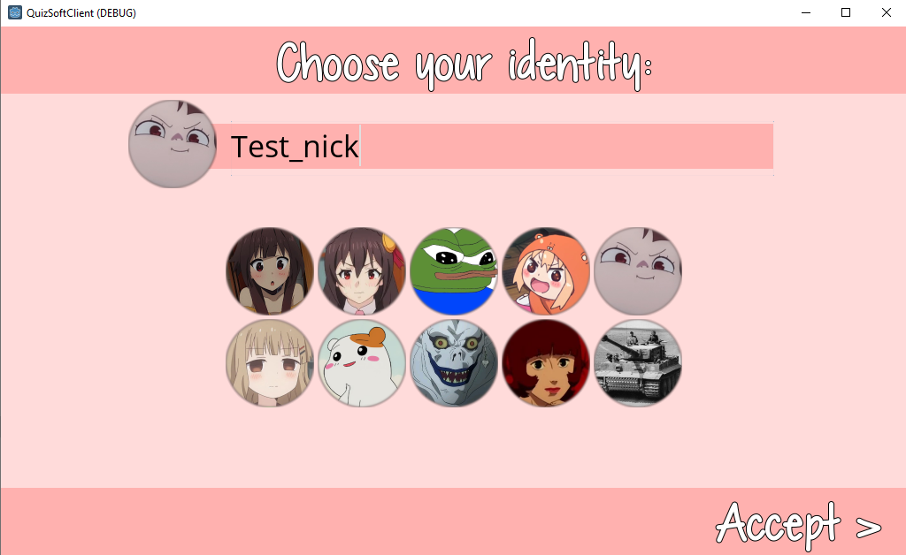
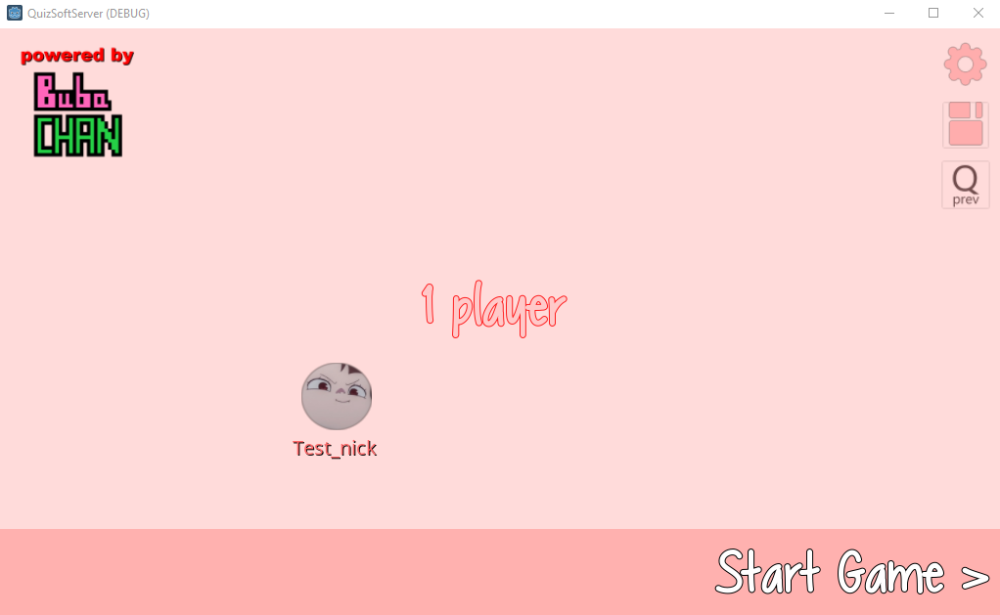
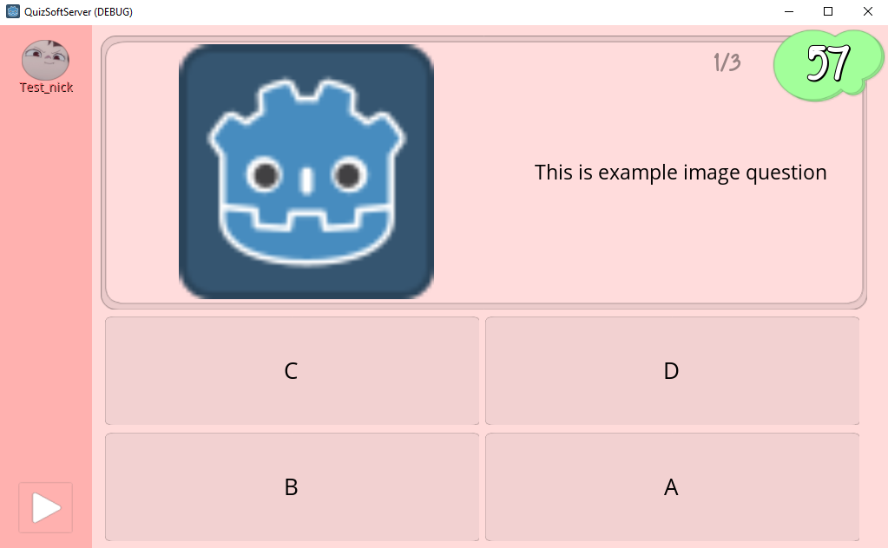

# Quiz App

Quiz application created with Godot engine. Use client-server architecture. Intended to use in local trusted networks (packet's data contain plain, unencrypted text).

**Client side:** [github repo](https://github.com/darkclif/QuizSoftwareClient) 

**Server side:** [github repo](https://github.com/darkclif/QuizSoftwareServer)

# Overview

The app is consisted of client side and server side. Client side is intended to work on android phone or any other device with internet connection targeted by godot build system. Server side application when running should be visible to all players, the common setup will be some PC connected to TV. If video-type questions are provided the working audio should be present as well.

# Gameplay

The gameplay structure:

* Players pick a nick and icon
* **(2)** Players are waiting for next question
* The question is showed
    * (~3 sec) Attention board
    * (~60 sec) Answer the question *(skip when all players answered)*
    * (~10 sec) Player icons go to given answers
    * (~30 sec) Time before next question *(skip when all players are ready)*
* *(Optional):* Summary board with players points
* Go to **(2)**
* Game ends

# Details

* To add new question modify question.txt file, structure of this file should hint you how this can be done.
    * Images should be placed in /question_images folder
    * Videos should be placed in /question_video folder (it's best to use webm extension with vp8 codec, vp9 doesn't work well with godot)
* Server and all clients should be in the same local network, this is important, the Internet connection is not needed.

# Screenshoots

* CLIENT:

* SERVER

